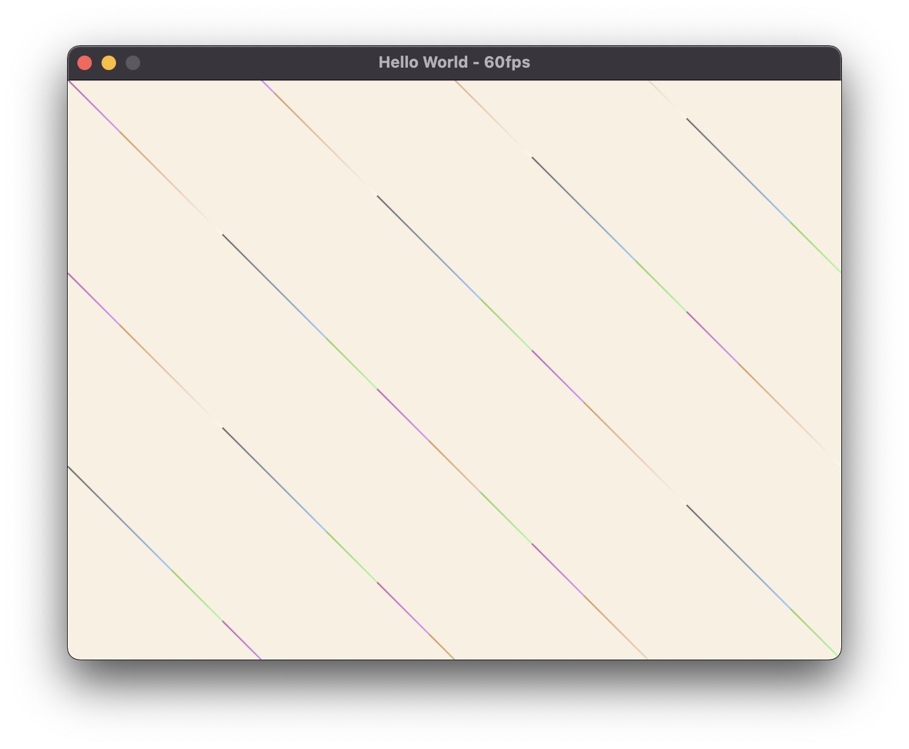

# sdl2-starter

A simple C++ starter for cross-platform SDL2 projects. Comes with a basic RAII window for streaming RGB24 images from the CPU.



```
brew install sdl2
make
./app
```

Refer to [this blog post](https://river.codes/setting-up-a-cross-platform-sdl-project/) for setting up a windows build. For a Linux build, install SDL2 through your package manager and refer to the comments in the Makefile for changing the linker instructions.

For info on why `Image` works, see [Images and Rendering](https://river.codes/emulating-a-computer-part-2/) and to learn what texture streaming is see [Graphics and Texture Streaming](https://river.codes/emulating-a-computer-part-3/).

I've used this starter for my emulation projects, and also for personal graphics research. If you're reading [Computer Graphics from Scratch](https://gabrielgambetta.com/computer-graphics-from-scratch/) this is one of the easier ways to get a `PutPixel` function up and running.